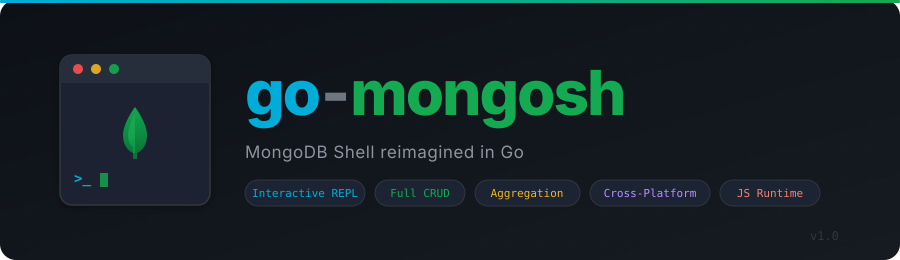

<p align="center">
  
</p>

A MongoDB Shell (`mongosh`) implementation written in Go. Provides a fully interactive JavaScript-based REPL for MongoDB with support for CRUD operations, aggregation, replica sets, sharding, user/role management, and more.

## Features

- **Interactive REPL** with tab completion, multi-line input, and persistent command history
- **Full CRUD** — `find`, `findOne`, `insertOne`, `insertMany`, `updateOne`, `updateMany`, `deleteOne`, `deleteMany`, `replaceOne`
- **Aggregation pipeline** — `aggregate`, `countDocuments`, `estimatedDocumentCount`, `distinct`
- **Cursor chaining** — `sort`, `limit`, `skip`, `projection`, `hint`, `comment`, `collation`, `pretty`, `explain`
- **Find-and-modify** — `findOneAndUpdate`, `findOneAndReplace`, `findOneAndDelete`, `findAndModify`
- **Bulk writes** — `bulkWrite`
- **Index management** — `createIndex`, `createIndexes`, `dropIndex`, `dropIndexes`, `getIndexes`
- **BSON types** — `ObjectId`, `NumberLong`, `NumberInt`, `NumberDecimal`, `ISODate`, `UUID`, `Timestamp`, `BinData`, `MinKey`, `MaxKey`
- **Database admin** — `db.stats()`, `db.runCommand()`, `db.adminCommand()`, `db.serverStatus()`, `db.currentOp()`, `db.killOp()`, `db.fsyncLock()`/`db.fsyncUnlock()`
- **User & role management** — `createUser`, `dropUser`, `getUsers`, `grantRolesToUser`, `createRole`, `dropRole`, and more
- **Replica set** — `rs.status()`, `rs.conf()`, `rs.initiate()`, `rs.add()`, `rs.remove()`, `rs.stepDown()`
- **Sharding** — `sh.status()`, `sh.addShard()`, `sh.enableSharding()`, `sh.shardCollection()`, balancer controls
- **Shell commands** — `show dbs`, `show collections`, `show users`, `use <db>`, `exit`
- **Eval mode** — run a command and exit with `--eval`
- **Cross-platform** — builds for Linux, macOS, and Windows (amd64/arm64)

## Installation

### From source

```bash
git clone https://github.com/adaptive-scale/go-mongosh.git
cd go-mongosh
make build
```

This produces a `mongosh` binary in the project root.

### From release

Download the latest release archive for your platform from the [Releases](https://github.com/adaptive-scale/go-mongosh/releases) page and extract the `mongosh` binary.

## Usage

```bash
# Connect to localhost:27017 (default)
mongosh

# Connect with a URI
mongosh mongodb://localhost:27017/mydb

# Connect to a specific host and port
mongosh --host myhost --port 27018

# Authenticate
mongosh -u admin -p
mongosh -u admin -p secret --authenticationDatabase admin

# Evaluate a command and exit
mongosh --eval 'db.stats()'

# Suppress the startup banner
mongosh --quiet

# Show version
mongosh --version
```

## Shell Examples

```javascript
// Switch database
use mydb

// List collections
show collections
db.getCollectionNames()

// Insert documents
db.users.insertOne({ name: "Alice", age: 30 })
db.users.insertMany([{ name: "Bob" }, { name: "Charlie" }])

// Query
db.users.find({ age: { $gte: 25 } }).sort({ name: 1 }).limit(10)
db.users.findOne({ name: "Alice" })

// Update
db.users.updateOne({ name: "Alice" }, { $set: { age: 31 } })
db.users.updateMany({}, { $inc: { age: 1 } })

// Delete
db.users.deleteOne({ name: "Bob" })
db.users.deleteMany({ status: "inactive" })

// Aggregation
db.orders.aggregate([
  { $match: { status: "completed" } },
  { $group: { _id: "$customerId", total: { $sum: "$amount" } } },
  { $sort: { total: -1 } }
])

// Indexes
db.users.createIndex({ email: 1 }, { unique: true })
db.users.getIndexes()

// Explain a query
db.users.find({ age: { $gt: 25 } }).explain("executionStats")

// Database admin
db.stats()
db.serverStatus()
db.currentOp()

// Replica set
rs.status()
rs.conf()

// Sharding
sh.status()
```

## Building

```bash
make build           # Build for the current platform
make test            # Run unit tests
make e2e             # Run end-to-end tests (requires a running MongoDB instance)
make release         # Cross-compile for all platforms (linux/darwin/windows, amd64/arm64)
make clean           # Remove build artifacts
make gh-release      # Create a GitHub release with artifacts (requires gh CLI)
```

## Architecture

```
cmd/mongosh/          CLI entry point and flag parsing
internal/
  mongoclient/        MongoDB driver client wrapper
  jsruntime/          Goja JavaScript runtime setup and global functions
  repl/               Interactive REPL with history and tab completion
  shell/              db, rs, and sh objects with collection/cursor support
  types/              BSON type constructors (ObjectId, ISODate, etc.)
  convert/            Bidirectional JS <-> Go/BSON value conversion
  output/             mongosh-style output formatting
tests/                End-to-end shell test scripts
```

## Dependencies

- [goja](https://github.com/dop251/goja) — JavaScript runtime in Go
- [mongo-driver v2](https://pkg.go.dev/go.mongodb.org/mongo-driver/v2) — Official MongoDB Go driver
- [liner](https://github.com/peterh/liner) — Line editing for the REPL
- [x/term](https://pkg.go.dev/golang.org/x/term) — Terminal utilities for password prompts

## License

See [LICENSE](LICENSE) for details.
